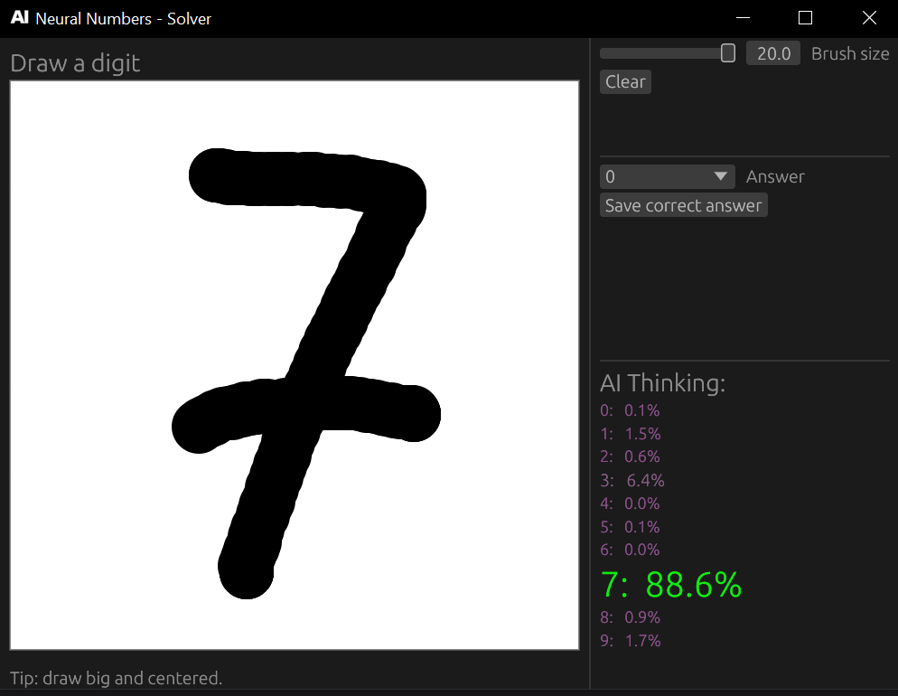

# Neural Numbers (Rust + eframe/egui + tch-rs)

A small desktop app that recognizes **handwritten digits (0–9)**.

This project is primarily a practical playground to learn:
  * building a GUI in Rust with `eframe/egui`
  * converting mouse strokes into a **MNIST-like 28×28** tensor
  * training / saving / loading weights with `tch-rs` (libtorch)
  * fine-tuning on your own samples collected from the GUI
* * *

## Binaries

- `solver_app` — GUI: draw a digit, get prediction + probabilities, save correct samples
- `trainer_app` — CLI: train on MNIST and fine-tune on `mydata/`

* * *

## Screenshots

* * *

## Features

### Solver (GUI)
  * Mouse drawing canvas
  * Brush size slider
  * **Space** hotkey → clear canvas
  * Live prediction + per-class probabilities
  * Save your correct label to build a dataset: `mydata/<0..9>/*.bin`

### Trainer (CLI)
  * Loads MNIST from `data/` (IDX ubyte format)
  * Trains a small MLP (784 → hidden → 10)
  * Saves weights to `models/mnist.ot` (configurable)
  * Fine-tunes on your GUI samples from `mydata/`

* * *

## Quick start

### Run solver (GUI)

    cargo run --bin solver_app

### Run trainer (MNIST training + fine-tune)

    cargo run --bin trainer_app

> Tip: both binaries read `config.json` from the **current working directory**.
> Run from the repo root to use the default paths (`data/`, `models/`, `mydata/`).

* * *

## Config (`config.json`)

Both binaries read/create `config.json` in the current working directory.

Example (default in this repo):

    {
      "epoch": 300,
      "data_dir": "data/",
      "out_path": "models/mnist.ot",
      "image_dim": 784,
      "hidden": 128,
      "labels": 10
    }

Notes:
- `image_dim` is **28×28 = 784** (MNIST-like flattened input).
- `hidden` is the MLP hidden layer size.
- `out_path` is what Solver loads and what Trainer writes.

* * *

## Data formats

### MNIST (`data/`)
Trainer expects the classic 4 MNIST IDX files in `data/`:

- `train-images-idx3-ubyte`
- `train-labels-idx1-ubyte`
- `t10k-images-idx3-ubyte`
- `t10k-labels-idx1-ubyte`

### My samples (`mydata/`)
Solver saves your drawings as **raw 28×28 grayscale**:

- Path: `mydata/<label>/<timestamp>.bin`
- Each `.bin` is exactly **784 bytes** (`u8`), row-major, values `0..255`

Trainer reads this folder and fine-tunes the model.

* * *

## Project structure

  * `src/bin/solver_app.rs` — GUI entry point (`eframe::run_native`)
  * `src/bin/trainer_app.rs` — training entry point
### Shared
  * `src/bin/shared_lib/c_trainer_config.rs` — config load/save (`config.json`)
  * `src/bin/shared_lib/f_ai_data.rs` — model builder (MLP)
### Solver
  * `src/bin/solver_lib/c_solver_app.rs` — UI + hotkeys + “save sample”
  * `src/bin/solver_lib/c_painter_module.rs` — stroke collection + canvas
  * `src/bin/solver_lib/f_utils.rs` — rasterize → 28×28 + predict + save helpers

* * *

## Notes / troubleshooting

### GPU / CUDA
The code uses:

    Device::cuda_if_available()

If you still see CPU, your libtorch build is likely CPU-only.
To use CUDA, you typically need a CUDA-enabled libtorch and/or to point `tch-rs` to an existing PyTorch install.

* * *

## About

A minimal “draw → rasterize → normalize to MNIST 28×28 → infer → fine-tune” pipeline in pure Rust.
